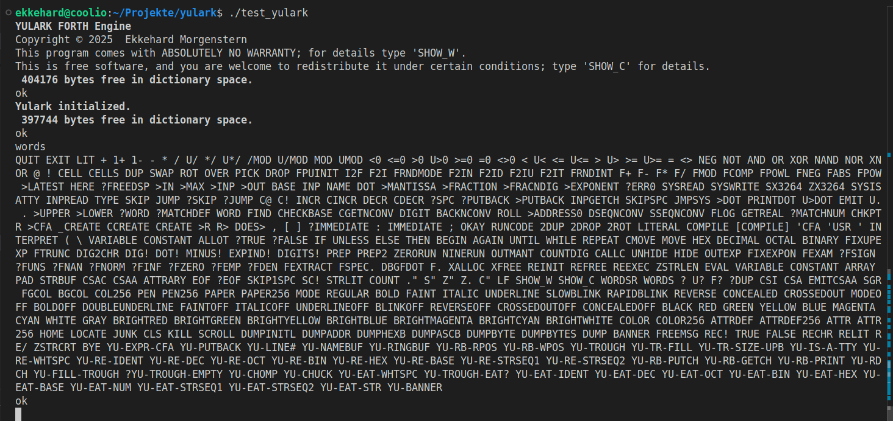
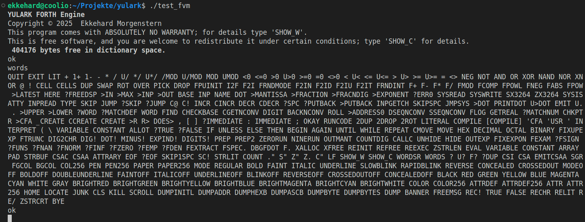

# yulark
A virtual machine written in C++

With a FORTH engine written in assembly language.

## Work in Progress

I've recently begun this project to test some ideas.

The YULARK engine is implemented in FORTH and well underway. It'll compile source text to FORTH (i.e. indirect threaded) object code. YULARK text will be converted to syntax trees on the fly and then compiled by FORTH.

The FORTH engine/subsystem is now fairly full-featured, with many extensions:

Some of its features are:
- 64 bit integers in base 2 to 36, signed and unsigned arithmetic
- 64 bit floating-point in base 2 to 36. Floating-point numbers can be passed just like addresses and integers on the parameter and return stacks.
- Supports string literals and regular expressions (using the GNU C library's regex functions, thus full-featured).
- Supports defining words with CREATE ... DOES>
- Supports control structures like IF ... ELSE ... THEN, UNLESS ... ELSE ... THEN, BEGIN ... AGAIN, BEGIN ... UNTIL, and BEGIN ... WHILE ... REPEAT.
- Written in x86-64 assembly code and hand-compiled FORTH code for UNIX-like operating systems (tested so far only on Linux).
- Classic indirect threaded FORTH code model, which is ideal for manual as well as automatic compilation.
- Large nucleus word set and library (the latter of which is compiled into the fvm_test program for demonstration purposes).
- Has CALLC for calling arbitrary C functions conforming to the x86-64 SYSV ABI specification. However, passing of arguments in XMM registers is NOT supported, which precludes direct passing of floating-point parameters. Nonetheless, this allows for the usage of user-defined (or library) C functions, for instance. Supports variable argument lists of arbitrary length.
- Has UNHIDE immediate word to permit recursion when using the compiler (i.e. during word definitions). The current definition will not be hidden anymore (which is usually done to be able to reference previous definitions of the same word). HIDE can be used to hide it again.
- Now better supports NUL-terminated strings (C style strings), and there's an EVAL function (the functionality of which has been used internally before, but wasn't exposed to the user).
- Bounds checking for parameter and return stack and dictionary pointers.
- Uses not a single global variable, thus suitable for multithread execution (with each FORTH instance in its own thread with its own memory).
- Stack frame of FORTH context is comparatively small with currently 1536 bytes of storage.
- The whole FORTH nucleus (fvm_asm) has currently less than 6000 lines of well-documented assembly code and hand-compiled FORTH code.
- The fvm_library contains additional features in less than 2000 lines of code that are now included in (compiled and linked into) the test_fvm program.
- fvm_aux contains C support functions that interface to the operating system and system library, it is compiled and linked into the test_fvm program, for instance.
- No AI was used for implementation.
- The provided test program "test_fvm" can be built and used to test/use the FORTH engine stand-alone, for debugging and other uses.

The FORTH subsystem will only work on x86-64 CPUs or compatibles (which most of the modern desktop and server CPUs are). An on-chip FPU is required for using floating-point (most of the current CPUs have that).
